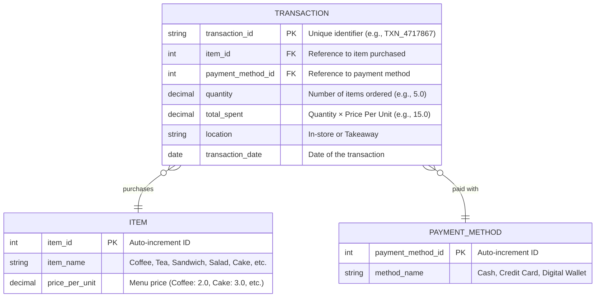

# Cafe Sales Database ERD

## Entity Relationship Diagram



## Entity Descriptions

### TRANSACTION
The main table that stores each individual item purchase. Each row represents one item being purchased in a transaction.

**Key Fields:**
- `transaction_id`: Unique identifier for tracking (e.g., TXN_4717867)
- `quantity`: Number of items purchased (can be decimal, e.g., 5.0)
- `total_spent`: Calculated as Quantity × Price Per Unit
- `location`: Either "In-store" or "Takeaway"

### ITEM
Reference table containing the cafe's menu items and their standardized pricing.

**Menu Items & Prices:**
- Coffee: $2.00
- Tea: $1.50
- Sandwich: $4.00
- Salad: $5.00
- Cake: $3.00
- Cookie: $1.00
- Smoothie: $4.00
- Juice: $3.00

### PAYMENT_METHOD
Reference table for payment types accepted at the cafe.

**Available Methods:**
- Cash
- Credit Card
- Digital Wallet

## Relationships

- **TRANSACTION → ITEM**: Many-to-One (Many transactions can reference the same item)
- **TRANSACTION → PAYMENT_METHOD**: Many-to-One (Many transactions can use the same payment method)

## Sample Data Example

```
Transaction ID: TXN_4717867
Item: Cake (item_id: 5)
Quantity: 5.0
Price Per Unit: $3.00
Total Spent: $15.00
Payment Method: Digital Wallet (payment_method_id: 3)
Location: Takeaway
Date: 2023-07-28
```

## Design Benefits

✅ **Simple Structure**: Direct mapping from CSV data to database tables
✅ **Easy Queries**: No complex joins needed for basic analysis
✅ **Scalable**: Easy to add new items or payment methods
✅ **Flexible**: Supports multi-item orders through multiple transaction records
